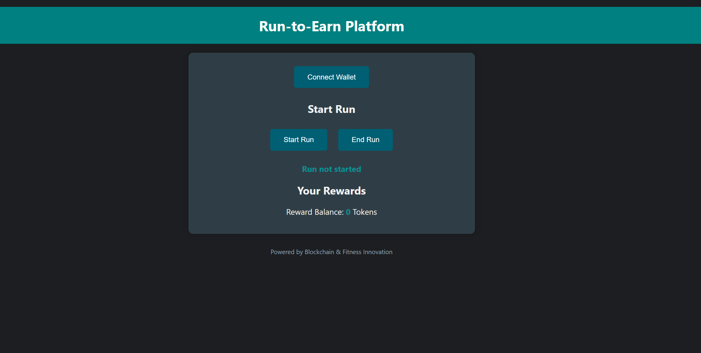
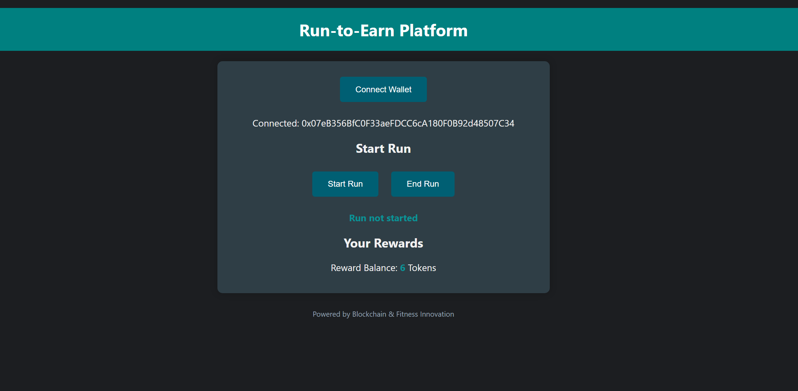
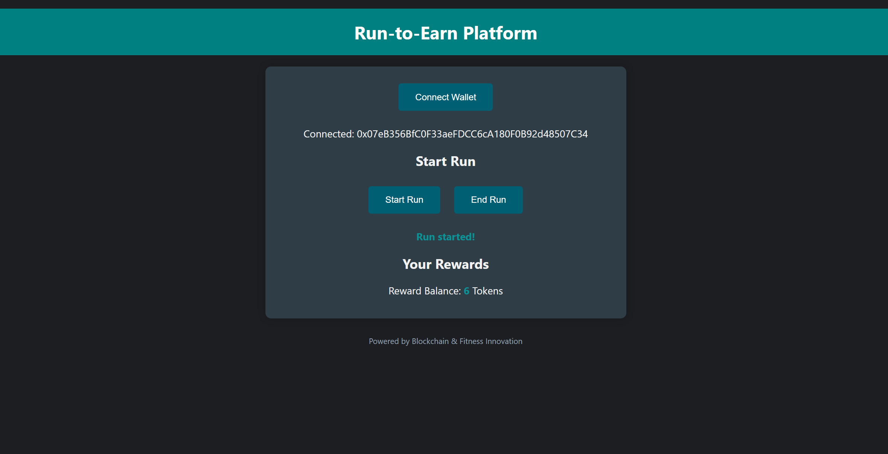
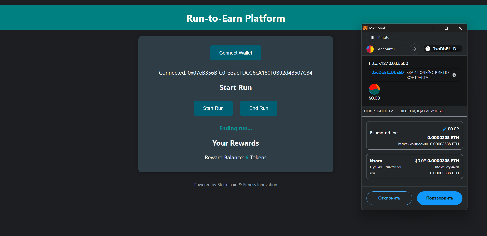
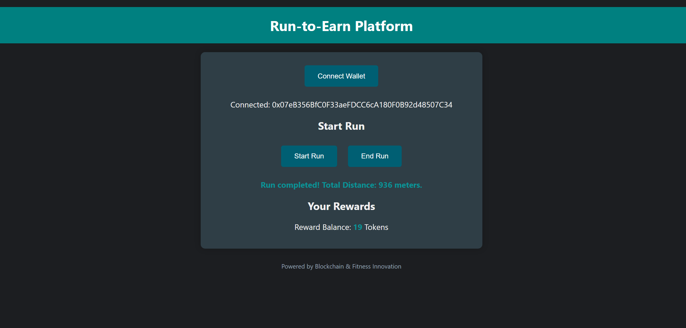

# Run-to-Earn Platform

## Usage

Run-to-Earn is a decentralized platform designed to incentivize physical activities like running by rewarding users with cryptocurrency. 
We are currently in the early development phase, and this version includes the second feature: a working prototype with a smart contract and a basic front-end.

### Current Features Implemented

- **Smart Contract**: Handles reward distribution based on the distance run, using Ethereum-based tokens.
- **Frontend Prototype**: Users can connect their wallet, simulate a run, and view their earned rewards in real-time.

## Demo Screenshots

## Examples

### How to Start Running and Earning:

1. **Connect Wallet**: Click on the "Connect Wallet" button.
2. **Start a Run**: Click on "Start Run" to begin tracking your run (simulated in this prototype).
3. **End Run**: Once done, click "End Run" to stop tracking and receive rewards.
4. **View Rewards**: Check your reward balance displayed in the UI.

### Smart Contract Overview

- **trackRunAndDistributeReward**: Logs user’s run and distributes rewards based on distance.
- **calculateReward**: Calculates tokens based on the distance covered.
- **getRewardBalance**: Displays the reward balance for any user.

## LICENSE

This project is licensed under the MIT License.
